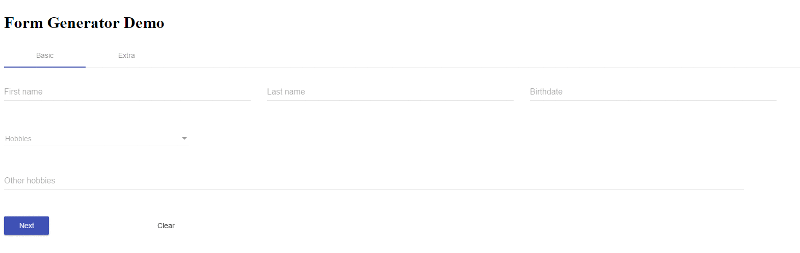

# Angular Form Generator
  
<br><br>A dynamic form generator for Angular with material design<br><br>


## Installation
```
npm install @angular/material
npm install angular-form-generator
```
## Setup
Import the FormGenerator Module and add it to the 'imports' of your module
```
import { FormGeneratorModule } from 'angular-form-generator';

@NgModule({
  imports: [FormGeneratorModule, MdNativeDateModule],
  ...
})
export YourModule { }
```
Set a link to a material theme in the ```<head>``` tag of index.html at the root of your application
```
<link href="node_modules/@angular/material/prebuilt-themes/indigo-pink.css" rel="stylesheet">
```

## Form Configuration
The form configuration is a json object that consists of required and optional parameters. 
```
{
  "formId": '123456Test',
  "form": 'animals',
  "type": 'lion',
  "version": 'v1',
  "pages":[
    {
      "title": "Title",
      "groups": [
        {
          "orientation": 0,
          "fields": [
            {
              "fieldName": 'field',
              "type": 'text'
            }
          ]
        }
      ]
    }
  ]
}
```

[The full form configuration documentation.](FORMCONFIG.md) 

## Usage

Create a new formConfig object. This will set all the required parameters to their default.

```
let formConfig = new FormConfig(formConfigJson);
```

Insert the ```<ngdg-form>``` inside your components html.

```
<div *ngFor="let pageObject of formConfig.pages">
  <ngdg-form [page]="pageObject" ... ></ngdg-form>
</div>
```

## Form component
The inputs and outputs.

| Parameter | Type | Description | Kind | |
|---|---|---|---|---|
| page | Page | Insert a page object the form generator has to build | Input | Required |
| data | any | Insert an object with the already filled in data. Make sure that the fieldName in the formConfig follow the path in the data object. [Example](#data-example) | Input | Optional |
| lov | Array key value pair | If the form has dropdowns that contain standard lovs | Input | Optional |
| readonly | boolean | Set if the whole form is readonly or not. Default: false | Input | Optional |
| focusChanged | EventEmitter | Emits an event wheter a form control is focused or blured | Output | Optional |
| registerForm | EventEmiiter | Emits an event when a new form is build. Returns a FormGroup | Output | Optional |
| next | EventEmitter | Emits an event when a button with type button is clicked | Output | Optional |
| submit | EventEmitter | Emits an event when a button with type submit is clicked | Output | Optional |

### Data example <a id="data-example"></a>
A data object example:
```
{
  information: {
    firstName: "Donald",
    lastName: "Duck"
  },
  answers: {
    age: 10,
    height: "1.80 m"
  }
}
```
A compatible formConfig object:
```
{
  "formId": '123456Test',
  "form": 'animals',
  "type": 'lion',
  "version": 'v1',
  "pages":[
    {
      "title": "Title",
      "groups": [
        {
          "orientation": 0,
          "fields": [
            {
              "fieldName": 'answers.age',
              "type": 'number'
            },
            {
              "fieldName": 'answers.height',
              "type": 'text'
            }
          ]
        }
      ]
    }
  ]
}
```

## Modifiers, Validators and Custom validators

For detailed information about the form configuration go to [formconfig documentation](FORMCONFIG.md)

### Validators

There are a few basic validators already included in the form generator. 
1. required
2. empty
3. maxValue
4. minValue

#### Usage example
```
{
  "fieldName": "Minutes",
  "type": "number",
  "validators": [
    {
      "name": "minValue",
      "value": 1
    },
    {
      "name": "maxValue",
      "value": 59
    }
  ]
}
```

### Modifiers

There are a few form modifiers which can modify the state of a field.
1. setValidators
2. setEnabled
3. setVisibility
4. setValue
5. setMaxDate
6. setMinDate

#### Usage example
```
{
  "fieldName": "Date",
  "type": "date",
},
{
  "fieldName": "Information",
  "type": "text",
  "disable": true,
  "regOnChange": {
    "parent": "Date",
    "callbacks": [
      {
        "method": "setEnabled",
        "param": true
      },
      {
        "method": "setValidator",
        "param": [
          {
            "name": "required",
            "value": true
          }
        ]
      }
    ]
  }
}
```

### Custom validators

There is also a possibility to make your own validators.<br>
First you have to inject the FormValidatorService into you component.
```
import { FormValidatorService } from "angular-form-generator/src/custom-validators/validator.service";

constructor(private formValidatorService: FormValidatorService){}
```

Now you can add custom validators to the form generator. The addValidator function takes two arguments.<br>
First the name of the validator, second the validation function.
```
this.formValidatorService.addValidator("validator", (max:number) => {
  return (control: AbstractControl) => {
      var num = +control.value;
      if(control.value != "" && num > max){
          return { maxValueError: "Value must be lower than " + max};
      }
  };
});
```

